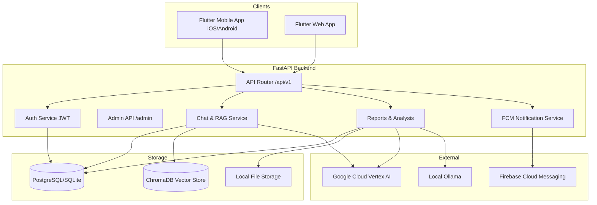

# MedNarrate Repository Audit & Admin Architecture Baseline

## A. Current Architecture Diagram


## B. Current Backend Domain Map
- **Authentication**: JWT based access and refresh tokens (`app/api/v1/auth.py`).
- **Users & Profiles**: `User`, `MedicalProfile`, `DoctorProfile`, `CaregiverProfile`.
- **Reports & Analysis**: `Report` (PDF/Image parsing), `ReportAnalysis` (structured lab values, entities, summaries), Multilingual Translation.
- **AI & RAG**: `llm_client.py` (Vertex AI, Ollama), `rag.py` (ChromaDB + Gemini embeddings), RAG Chunks.
- **Chat**: `ChatSession`, `ChatMessage`, Safety Intent Classifier, RAG integration.
- **Notifications & Reminders**: `MedicationSchedule`, FCM Push Notifications (`NotificationLog`, `PushToken`).
- **File Storage**: Local filesystem based storage for uploads and reports.

## C. Existing Authentication Flow
- **Signup/Login**: Standard email/password signup. Password hashed via bcrypt (`app/core/security.py`).
- **Tokens**: Issues short-lived JWT `access_token` and long-lived `refresh_token`. Refresh tokens are stored in the DB (`RefreshToken` model) with revocation capabilities to prevent reuse.
- **Middleware/Security**: SlowerAPI rate limiting, CORS, Strict Transport Security headers, and Prompt Injection detection middleware.

## D. Existing Authorization Flow
- **Dependency Injection**: Uses `get_current_user` to validate JWT and fetch `User`.
- **Role-Based Access Control (RBAC)**: `UserRole` enum (`patient`, `clinician`, `caregiver`, `admin`).
- **Resource Ownership**: Endpoints verify resource ownership via `verify_report_ownership` and `verify_chat_session_ownership` dependencies before granting read/write access.
- **Admin Access**: `require_admin` dependency checks if `current_user.role.value == "admin"`.

## E. Existing Database Entities
- **Core**: `User`, `RefreshToken`
- **Profiles**: `MedicalProfile`, `DoctorProfile`, `CaregiverProfile`
- **Reports**: `Report`, `ReportAnalysis`, `ReportTranslation`, `AnalysisTranslation`
- **AI/Chat**: `RagChunk`, `ChatSession`, `ChatMessage`
- **Notifications**: `PushToken`, `NotificationLog`, `MedicationSchedule`

## F. Existing API Endpoints Relevant to Admin Operations
- `GET /api/v1/admin/health`: Basic admin health check.
- `GET /api/v1/admin/kb-stats`: Mock knowledge base statistics.
- `GET /api/v1/admin/llm-status`: Returns current LLM provider health, costs guardrails, and privacy mode.
- `GET /api/v1/users/me`: Current user details.
- `PATCH /api/v1/users/me`: User updates.

## G. Existing Failure/Diagnostic Information
- Failed analysis statuses are tracked via `ProcessingStatus.failed` in `Report`.
- Failure reasons and categories are saved in `ReportAnalysis.error_reason` and `ReportAnalysis.failure_category`.
- Notification failures are logged in `NotificationLog.error_message`.
- Prompt injection attempts are intercepted at the middleware layer.

## H. Existing AI/RAG/chat Architecture
- **LLM Client**: Abstract `LLMProvider` with implementations for `VertexAIProvider`, `OllamaProvider`, and `DevGeminiProvider`.
- **RAG**: Chunks text with deterministic boundaries. Uses Gemini `models/gemini-embedding-001` for embeddings. Stores in local ChromaDB. Uses BM25 as a fallback.
- **Chat**: Has a deterministic intent classifier to intercept medical advice / emergency queries. Feeds RAG context to the LLM for response generation.

## I. Existing Notification/Reminder Architecture
- **Push Tokens**: Stores FCM tokens in `PushToken`.
- **Schedules**: `MedicationSchedule` stores medication details, dosages, and times.
- **Delivery**: Uses `firebase-admin` to dispatch notifications. Logs all attempts (success/fail) to `NotificationLog`.

## J. Existing Logging/Observability
- Standard Python `logging` module is used across services (e.g., `logger.info`, `logger.error`).
- Logs execution times and request IDs in `llm_client.py`.
- No distributed tracing (e.g., OpenTelemetry) is currently configured.

## K. Existing Admin Implementation
- Extremely minimal. An API router (`admin.py`) exists with only 3 GET endpoints.
- Requires user to have the `admin` role.
- No frontend UI for admin operations exists. The repository only contains a Flutter application meant for end-users (patients/clinicians).

## L. Security Constraints
- Minimal Privilege: Admin routes explicitly require the admin role.
- Prompt Injection Middleware: Blocks malicious requests at the HTTP layer.
- Token Revocation: System tracks refresh token usage and detects token theft (revoking all sessions).

## M. Privacy Constraints
- AI Privacy Mode: Configured via `LLM_SEND_MODE`.
- De-identification: Reports are sanitized (`deidentify_prompt_text`) before RAG chunking and LLM processing.
- Security Headers: X-Frame-Options, X-Content-Type-Options, HSTS implemented.

## N. Areas that can be reused
- Existing `User`, `UserRole`, and `require_admin` mechanisms can be entirely reused for admin authentication.
- Existing `llm_client.py` and `llm-status` endpoints can be extended for AI Operations dashboard.
- Existing `ReportAnalysis.error_reason` can power the Incidents/Failures dashboard.

## O. Missing Infrastructure Required for Admin Operations
- **Admin Audit Logs**: No table exists to track administrative mutations (e.g., who deleted a user, who changed a feature flag).
- **Advanced Pagination/Filtering**: Existing endpoints lack robust filtering (e.g., filtering users by role, sorting by creation date for data tables).
- **System Config Management**: Application settings (e.g., Maintenance Mode) are currently static environment variables rather than database-driven configurable flags.
- **Data Aggregation**: Endpoints for analytics (e.g., daily active users, LLM token usage over time) are missing.

## P. Risks and Compatibility Concerns
- **Data Privacy**: Exposing full `Report` data in the admin panel risks PHI exposure. Admin APIs must redact PII/PHI unless specifically authorized via an audit-logged action.
- **Flutter Backwards Compatibility**: Adding admin fields to existing schemas must remain optional to avoid breaking the Flutter app's serialization.
- **CORS**: The Next.js admin app will need its origin whitelisted in `settings.CORS_ORIGINS`.

## Q. Proposed Admin Architecture
```mermaid
flowchart TD
    AdminUI[Next.js App Router UI\n(mednarrate-admin)]
    FastAPI[FastAPI Backend\n(/api/v1/admin/...)]
    Database[(PostgreSQL)]

    AdminUI -- REST / JSON --> FastAPI
    FastAPI -- SQLAlchemy --> Database
```
- **Frontend**: Next.js App Router (React), TypeScript, Tailwind CSS, shadcn/ui.
- **State**: TanStack Query for server state management.
- **Location**: Top-level directory `/mednarrate-admin`.
- **Backend Integration**: Extensions to `app/api/v1/admin.py` utilizing the existing JWT auth.

## R. Proposed Admin Sitemap
- **Overview**: High-level KPIs, recent system alerts.
- **Support**: User impersonation (with strict audit), ticket management.
- **Users**: User list, role management, profile inspection.
- **Reports**: Failed report analysis queue, processing metrics.
- **AI Operations**: LLM health, RAG chunk inspection, token usage.
- **Chat**: Flagged chat sessions (safety classifier hits).
- **Notifications**: Delivery success rates, manual broadcast.
- **Knowledge Base**: ChromaDB stats, document ingestion.
- **System Health**: Backend health, database latency.
- **Incidents**: Error logs, LLM timeouts.
- **Analytics**: Usage charts, user growth.
- **Security**: Audit logs, Admins, Roles, Temporary Access Grants.
- **Configuration**: Feature flags, Maintenance mode, LLM Provider toggle.

## S. Proposed Admin Roles and Permission Matrix
| Role | View Users | View PHI | Mutate System Config | View Audit Logs | Manage Admins |
|---|---|---|---|---|---|
| **Super Admin** | Yes | Yes (Audited) | Yes | Yes | Yes |
| **Support Admin** | Yes | No | No | No | No |
| **Data Admin** | No | Yes (Audited) | No | No | No |
| **System Admin** | No | No | Yes | Yes | No |
*(Currently `UserRole.admin` is a catch-all. We will introduce granular permissions inside the Admin portal).*

## T. Proposed Admin Database Entities
1. `AdminAuditLog`: Tracks `admin_id`, `action`, `resource`, `timestamp`, `ip_address`.
2. `FeatureFlag`: Dynamic system configuration (e.g., `maintenance_mode`, `active_llm_provider`).

## U. Proposed Admin API Surface
- `GET /api/v1/admin/users`: Paginated user list.
- `GET /api/v1/admin/users/{id}`: User details (redacted PHI).
- `GET /api/v1/admin/reports/failed`: Queue of failed report processing jobs.
- `GET /api/v1/admin/analytics/usage`: Time-series data for LLM usage.
- `GET /api/v1/admin/audit-logs`: Paginated audit events.
- `PUT /api/v1/admin/config`: Update dynamic system settings.

## V. Proposed Testing Strategy
- **Backend Tests**: `pytest` tests in `mednarrate-backend/tests/api/test_admin.py` verifying RBAC (403 for non-admins) and data integrity.
- **Frontend Tests**: Jest / React Testing Library for component rendering and access control hooks.
- **E2E**: Playwright tests verifying the admin login flow and critical read-only dashboards.
